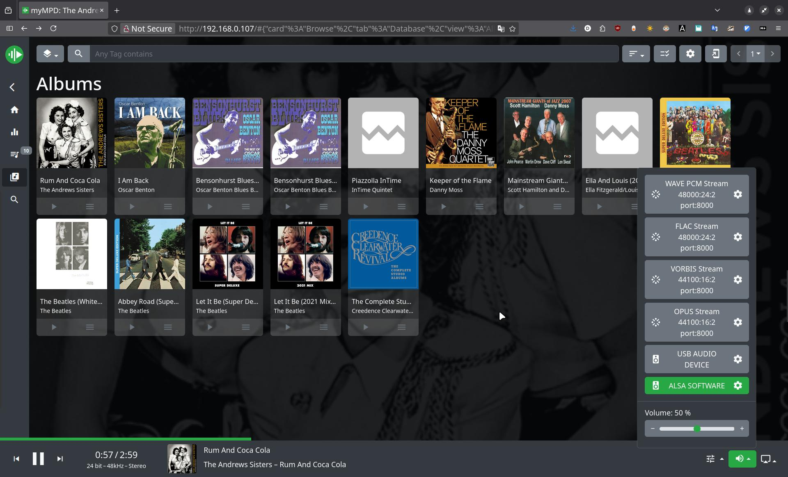

<!-- # MucicLounge (under development at the moment) -->
# MucicLounge
* MusicLounge is a music player daemon based on [MPD-SACD](https://sourceforge.net/projects/mpd.sacddecoder.p), playing various music formats, including sacd ISO images.  
  Added the following services: [MPD-based UPnP Audio Media Renderer](https://www.lesbonscomptes.com/upmpdcli/), MPD web-based client [myMPD](https://github.com/jcorporation/mympd), [Samba](https://www.samba.org) server,   
  [ReadyMedia](https://sourceforge.net/projects/minidlna) (previously MiniDLNA) and MCIS web server (music content image show.).
* All services run on Docker containers except for the Samba client for mounting the Samba share on the host.

## MusicLounge
* Default dirs structure:
        
        /mnt
         └── musiclounge
             ├── local   # local music mount
             └── remote  # SMB mount

* /mnt/musiclounge - default MusicLounge root directory. 
* How it works, for example MusicLounge run on host 192.168.0.123 
    * MPD scan default MPD root directory and build the MPD database.
    * myMPD connects to MPD and provides a web interface at 192.168.0.123 to browsing and play audio content of MPD database.
    * UPnP Audio Media Renderer provides option to play music from any source(DLNA, TIDAL, Qobuz, Google Drive, etc.)  
      on MusicLounge (see [BubbleUPnP](https://play.google.com/store/apps/details?id=com.bubblesoft.android.bubbleupnp) android application).  
      In BubbleUPnP it appears under Devices -> Renderers as 'MusicLounge-Render'.
    * To view images corresponding to the audio content being played, type in web browser: '192.168.0.123:5000'
    * To work with files, connect to the Samba share with a file manager such as Nemo, Thunar, etc. at smb://192.168.0.123/music.

## Minimum requirements
* Hardware:  
    * CPU: Intel(R) Celeron(R) N4020 CPU @ 1.10GHz  
    * RAM: 2G  
    * SSD: 64G  
* Recomended OS:  
    * archlinux without GUI ([archlinux](https://archlinux.org/download/#download-mirrors), [archlinux](https://ftp.belnet.be/arcolinux/arcoinstall/index.html) from [arcolinux](https://arcolinux.com/))

## Supported OS
* Arch Linux (verified)
* Ubuntu
* Debian
* Fedora, Red Hat
* Alpine Linux

## Installation
* Run musiclounge_install.sh for interactive installation.

## ToDo
* Automatization:  
    * Convert All SACD ISO Albums to DSF tracks.
* Update services, each separately(requires additional service server creation).
* Remote control support with any bluetooth remote control.

### Buy Me a Coffee

##### PayPal
<!--  -->

<!-- ################################################### -->
<!-- Shareable link -->
<!-- https://www.paypal.com/donate/?business=E8WFBANKBM5CL&no_recurring=0&item_name=Thank+You+for+the+support%21&currency_code=ILS -->

<!-- Donate button -->
<!-- <form action="https://www.paypal.com/donate" method="post" target="_top"> -->
<!-- <input type="hidden" name="business" value="E8WFBANKBM5CL" /> -->
<!-- <input type="hidden" name="no_recurring" value="0" /> -->
<!-- <input type="hidden" name="item_name" value="Thank You for the support!" /> -->
<!-- <input type="hidden" name="currency_code" value="ILS" /> -->
<!-- <input type="image" src="https://www.paypalobjects.com/en_US/IL/i/btn/btn_donateCC_LG.gif" border="0" name="submit" title="PayPal - The safer, easier way to pay online!" alt="Donate with PayPal button" /> -->
<!--  -->
<!-- </form> -->
<!-- ################################################### -->

<!-- Prepair: -->
<!--     See mnt_music_dirs.sh, edit it and run it: -->
<!--      1) REMOTE_SMB_MOUNT_DIR variable -->
<!--         SMB_USERNAME="" -->
<!--         SMB_PASSWORD="" -->
<!--      2) LOCAL_MUSIC_DIR variable -->
<!-- Default dirs structure: -->
<!--     /mnt -->
<!--     └── music -->
<!--         ├── local_music   # link to your local music directory -->
<!--         └── remote_music  # for SMB mount -->
    
<!-- Minimum requirements: -->
<!--     Hardware: -->
<!--         CPU: Intel(R) Celeron(R) N4020 CPU @ 1.10GHz -->
<!--         RAM: 2G -->
<!--         SSD: 64G -->
<!--     Recomended OS: -->
<!--         archlinux without GUI -->
        
<!-- TODO:  -->
<!--     Add Samba, Minidlna services -->
<!--     scripts: -->
<!--         prepair bash script: -->
<!--             mympd copy -->

